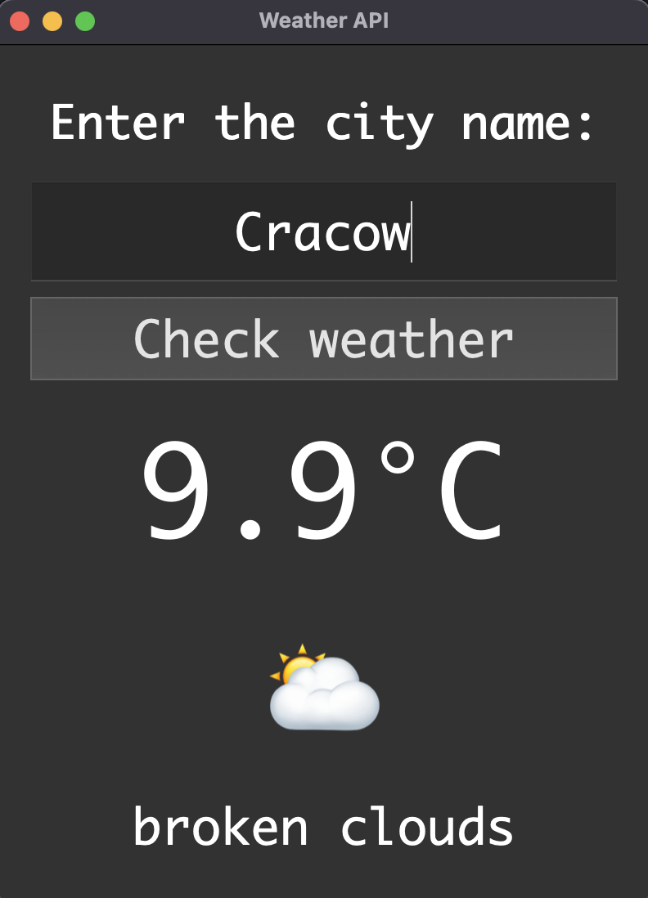

# 🌤️ WeatherApp — Python + PyQt5 + OpenWeatherMap API

A simple, desktop app built with **Python** and **PyQt5 Framework** that fetches real-time weather data using the **OpenWeatherMap API**.  
Enter any city name to see the current temperature, weather description, and matching emoji icon.

---

## 🖥️ Preview


---

## 🚀 Features
- Fetches live weather data from **OpenWeatherMap API**  
- Displays:
  - 🌡️ Temperature in Celsius  
  - 🌤️ Weather condition & emoji icon   
- GUI made with **PyQt5**  
- **Error handling** for network and API issues  
- **Monaco font styling**

---

## 🛠️ Technologies Used
- **Python 3.13+**
- **PyQt5** – GUI framework
- **Requests** – API communication
- **OpenWeatherMap API** – weather data provider

---

## 📦 Installation

Clone this repository:
```bash
git clone https://github.com/YourUsername/WeatherApp.git
cd WeatherApp

Create and activate a virtual environment:

python -m venv venv
# Windows
venv\Scripts\activate
# macOS/Linux
source venv/bin/activate

Install dependencies:
pip install -r requirements.txt
```

## API Setup 

1.	Go to OpenWeatherMap
2.	Sign up and get your free API key
3.	Replace the placeholder in main.py: 
    ```python 
    api = "YOUR_API_KEY_HERE"
    ```

## Run the app

```bash
python app.py
```

--- 

## 📁 Project Structure:

WeatherApp/
│
├── graphics/
│   └── icon.png
│   └── image.png
│
├── app.py
├── requirements.txt
└── README.md

---

## Author: 

Jakub "Akamaara" Pawlusek
3rd Year Applied Computer Science Student
💼 Aspiring Software Developer
🎮 Gamer | Creator | Coder

📧 Contact: jpawlusek.dev@gmail.com
🌐 GitHub: https://github.com/akamanyara